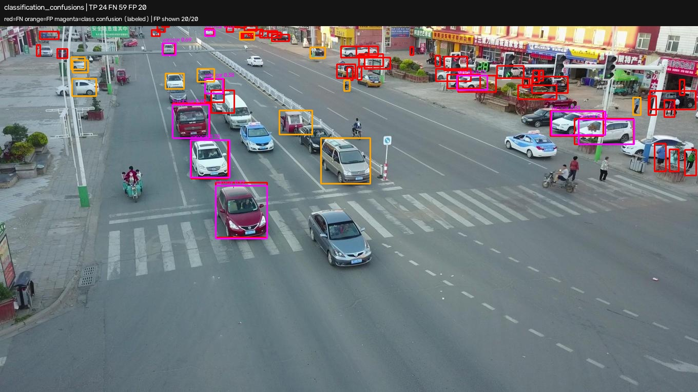

# E01 Locked-Subset Error Analysis

Tanggal run: 7 Agustus 2026  
Experiment: `E01A_20260807_001`  
Status: **passed**

## Hasil utama

Pada operating point `confidence=0,25` dan class-aware matching `IoU=0,50`,
checkpoint E01 paling lemah pada object kecil dan heavily occluded. Recall
object kecil adalah 0,325061, dibandingkan 0,731993 untuk medium dan 0,836735
untuk large. Recall heavily occluded hanya 0,174004, dibandingkan 0,622742
untuk object tanpa occlusion.

Angka ini bukan AP dan tidak menggantikan evaluasi E00/E01. Tujuannya adalah
mendiagnosis pola kegagalan pada satu operating point yang eksplisit.

## Protokol

- Model: `E01_20260807_001/best.pt`, SHA-256
  `d5fcbeab43dc5706ea743d834094495be241836da2b25910c1cd1757f84faea5`.
- Data: 128 image validation yang sama dengan E00/E01E; selection SHA-256
  `7e1bd549153bea5fa2d6f1e17a4e7f29f57f11157c6c277441a6d00520c265bd`.
- Backend: PyTorch CPU/FP32, image size 640, batch 4, rect mode.
- Prediksi: confidence 0,25, NMS IoU 0,7, maksimum 300 deteksi.
- Matching error: class-aware, satu-ke-satu, IoU minimum 0,50.
- Size menggunakan luas bbox pada resolusi image asli: small `<1024 px²`,
  medium `1024–<9216 px²`, large `>=9216 px²`.
- Occlusion (`none`, `partial`, `heavy`) dan truncation berasal langsung dari
  anotasi resmi VisDrone. Urutan dan geometri setiap object diverifikasi ulang
  terhadap label YOLO hasil konversi.

Perintah reproduksi:

```text
YOLO_CONFIG_DIR=/tmp .venv/bin/python scripts/analyze_detection_errors.py --config configs/e01_error_analysis.yaml
```

## Total pada operating point

| Ground truth | Prediksi | TP | FN | FP | Precision | Recall |
|---:|---:|---:|---:|---:|---:|---:|
| 6.090 | 4.218 | 2.975 | 3.115 | 1.243 | 0,705311 | 0,488506 |

## Recall berdasarkan kondisi

### Ukuran object

| Size | GT | Matched | Missed | Recall |
|---|---:|---:|---:|---:|
| Small | 3.707 | 1.205 | 2.502 | 0,325061 |
| Medium | 2.138 | 1.565 | 573 | 0,731993 |
| Large | 245 | 205 | 40 | 0,836735 |

### Occlusion

| Occlusion | GT | Matched | Missed | Recall |
|---|---:|---:|---:|---:|
| None | 2.990 | 1.862 | 1.128 | 0,622742 |
| Partial | 2.623 | 1.030 | 1.593 | 0,392680 |
| Heavy | 477 | 83 | 394 | 0,174004 |

### Kelas

| Kelas | GT | Matched | Missed | Recall |
|---|---:|---:|---:|---:|
| Pedestrian | 1.946 | 484 | 1.462 | 0,248715 |
| Car | 3.417 | 2.315 | 1.102 | 0,677495 |
| Van | 487 | 119 | 368 | 0,244353 |
| Truck | 187 | 37 | 150 | 0,197861 |
| Bus | 53 | 20 | 33 | 0,377358 |

Truncated object memiliki recall 0,662116 (194/293), sedangkan object
not-truncated 0,479731 (2.781/5.797). Perbedaan ini tidak membuktikan truncation
membantu deteksi karena ukuran, kelas, scene, dan jumlah sampelnya tidak
dikontrol. Bottleneck yang konsisten dan besar pada run ini adalah size dan
occlusion.

## Class confusion dan false positive

Terdapat 237 pasangan class-confusion: prediction dan GT overlap minimal 0,50
tetapi kelasnya berbeda. Confusion terbesar adalah `van -> car` sebanyak 155
kasus (65,4% dari seluruh class-confusion), diikuti `truck -> car` 31 dan
`car -> van` 29. Ini menunjukkan pemisahan kelas kendaraan yang mirip masih
lemah pada sudut pandang aerial.

Dari 1.243 false positive, 850 berlabel car, 278 pedestrian, 84 van, 19 truck,
dan 12 bus. Nilai tersebut berasal dari threshold 0,25 dan tidak boleh dibaca
sebagai distribusi FP pada semua threshold.

## Contoh kegagalan terpilih

Overlay dipilih deterministik berdasarkan kategori kegagalan. Merah adalah FN,
oranye adalah FP, dan magenta adalah class-confusion. Karena scene VisDrone
padat, hanya class-confusion yang diberi teks; metadata lengkap tersedia di
CSV mentah.

| Alasan | Image | TP | FN | FP | Detail utama |
|---|---|---:|---:|---:|---|
| Small FN | [0000291...0884](../results/day2/E01A_20260807_001/overlays/01_small_false_negatives_0000291_03201_d_0000884.jpg) | 54 | 120 | 36 | 102 small FN |
| Heavy occlusion FN | [0000280...0620](../results/day2/E01A_20260807_001/overlays/02_heavy_occlusion_false_negatives_0000280_01601_d_0000620.jpg) | 41 | 50 | 11 | 22 heavy-occlusion FN |
| Truncated FN | [0000301...0156](../results/day2/E01A_20260807_001/overlays/03_truncated_false_negatives_0000301_00001_d_0000156.jpg) | 16 | 34 | 10 | 7 truncated FN |
| Class confusion | [0000277...0548](../results/day2/E01A_20260807_001/overlays/04_classification_confusions_0000277_01801_d_0000548.jpg) | 24 | 59 | 20 | 9 confusions |
| False positive | [0000295...0029](../results/day2/E01A_20260807_001/overlays/05_false_positives_0000295_01600_d_0000029.jpg) | 66 | 49 | 37 | FP terbanyak |
| Total errors | [0000295...0034](../results/day2/E01A_20260807_001/overlays/06_total_errors_0000295_02900_d_0000034.jpg) | 79 | 85 | 21 | 106 total errors |



## Implikasi dan langkah berikutnya

1. Deployment dan tracking harus diuji pada scene padat dan object kecil;
   tracking temporal dapat membantu continuity tetapi tidak menghapus FN
   detector.
2. Eksperimen resolusi lebih tinggi atau tiling layak diuji kemudian karena
   small-object recall jauh di bawah medium/large. Belum ada klaim bahwa metode
   tersebut pasti meningkatkan hasil.
3. Confusion `van/car/truck` perlu dipantau pada demo dan benchmark. Perbaikan
   yang mungkin adalah hard-example sampling atau penyeimbangan kelas, tetapi
   memerlukan experiment ID baru.
4. Threshold 0,25 adalah satu titik operasi untuk diagnosis. Threshold final
   harus dipilih berdasarkan trade-off precision/recall pada kebutuhan demo.

## Artefak audit

- [Summary JSON](../experiments/E01A_20260807_001/summary.json)
- [Ground-truth outcomes](../results/day2/E01A_20260807_001/ground_truth_outcomes.csv)
- [False positives](../results/day2/E01A_20260807_001/false_positives.csv)
- [Classification confusions](../results/day2/E01A_20260807_001/classification_confusions.csv)
- [Per-image summary](../results/day2/E01A_20260807_001/image_summary.csv)

Seluruh headline number di dokumen ini berasal dari file summary/CSV tersebut.
Overlay hanya bukti kualitatif terpilih, bukan pemeriksaan manual seluruh 128
image.
