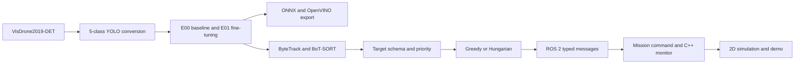

# End-to-end report: from the VisDrone dataset to ROS 2

Document date: 10 August 2026 (Asia/Jakarta)  
Scope status: **complete for a ROS 2 software prototype and 2D simulation**

## 1. Summary

This project builds a measured pipeline for aerial object perception and multi-UAV mission decisions. The VisDrone dataset is downloaded and converted to five YOLO classes, a nano model is evaluated and fine-tuned, the result is exported and validated, aerial video is processed by a tracker, targets are prioritized and assigned to virtual UAVs, and the decisions are sent through ROS 2 Jazzy nodes and visualized in a 2D simulation.



This pipeline is evidence of software integration. The project is **not** a physical UAV system, a flight controller, evidence of flight safety, or a production deployment benchmark.

## 2. Environment and reproducibility rules

Development and verification were done on Windows 11 with WSL 2 Ubuntu 24.04, Python 3.12, ROS 2 Jazzy, PyTorch/Ultralytics, OpenCV, SciPy, and OpenVINO. Every milestone uses a run ID, a YAML configuration, JSON/CSV summaries, and visual artifacts. The raw dataset, checkpoints, and large MP4 files are deliberately kept out of Git; manifests, hashes, reports, and evidence frames are tracked.

ROS installation notes are in [ROS_JAZZY_ENVIRONMENT.md](ROS_JAZZY_ENVIRONMENT.md), and the clean verification commands are in [REPRODUCTION.md](REPRODUCTION.md).

## 3. Stage 1 — Downloading VisDrone2019-DET

The dataset is **VisDrone2019-DET**, the object-detection-in-images task. Only the official train and val splits are used. The official source, access policy, and redistribution limits are recorded in [VISDRONE_DATA.md](VISDRONE_DATA.md).

Documented commands to download and verify the source:

```bash
.venv/bin/python -m pip install -r requirements-day2.txt
.venv/bin/python scripts/download_visdrone.py --plan
.venv/bin/python scripts/download_visdrone.py --splits train val
```

The downloader records the SHA-256, ZIP size, image and annotation counts, and access time in data/metadata/visdrone2019_det_download_manifest.json. Extraction rejects ZIP paths that escape the target directory.

| Split | Images | Annotations | ZIP size | SHA-256 |
| --- | ---: | ---: | ---: | --- |
| train | 6,471 | 6,471 | 1,549,875,511 bytes | 86a77e...e256f84 |
| val | 548 | 548 | 81,638,851 bytes | abeea0...2a35ef9 |

The first download from Google Drive hit the public quota. The data later became available through the same official, authorized mechanism and was verified against the manifest before processing. The repository does not redistribute the dataset; the terms of use should be checked again before any public or commercial use.

## 4. Stage 2 — Conversion, sanitization, and data audit

VisDrone is converted to YOLO format with five locked classes: pedestrian, car, van, truck, and bus. The full mapping and annotation-field rules are in [VISDRONE_DATA.md](VISDRONE_DATA.md).

```bash
.venv/bin/python scripts/prepare_visdrone.py --check-config
.venv/bin/python -m pytest -q tests/test_visdrone_dataset.py tests/test_visdrone_audit.py tests/test_visdrone_distribution.py
.venv/bin/python scripts/prepare_visdrone.py
.venv/bin/python scripts/render_visdrone_audit.py --split val --samples 6
.venv/bin/python scripts/analyze_visdrone_distribution.py
```

The result is passed_with_sanitization: all 6,471 train pairs and 548 val pairs remain complete, and conversion produces 267,960 train objects and 25,884 val objects. Three source bboxes with zero height are excluded and recorded, 34 empty trailing commas are normalized, and the output validator reports zero invalid bboxes and zero filename overlaps between splits. Six deterministic audit overlays covering all five classes were inspected.

Primary evidence: [five-class manifest](../data/metadata/visdrone5_manifest.json), [validation summary](../experiments/D01_visdrone_validation/summary.json), and the [Day 2 report](DAY_2_REPORT.md).

## 5. Stage 3 — Baseline, smoke training, and fine-tuning

### E00 baseline

The COCO-pretrained yolo26n.pt model is evaluated on a locked validation subset of 128 images (6,090 objects) on CPU/FP32 at size 640. The E00 macro baseline is precision 0.289228, recall 0.173370, mAP50 0.154190, and mAP50-95 0.096881. The van class scores zero in the baseline because the COCO labels have no separate van class.

Two early baseline attempts produced no metrics because the filenames were replaced with generated names. Both are kept with metrics: null; the accepted run is E00_20260807_003, which used a .txt file list to preserve the source names.

### Smoke run and E01

A three-epoch smoke run demonstrated GPU training on a Tesla T4 and resuming from a checkpoint that still holds the optimizer state. The main fine-tuning run, E01_20260807_001, used all training data for 30 epochs with AdamW, seed 42, batch 16, image size 640, and AMP. The session was cut off after epoch 11, resumed from the epoch 10 checkpoint, and still completed all 30 epochs.

On full validation, the final checkpoint records precision 0.53166, recall 0.38044, mAP50 0.38521, and mAP50-95 0.23458. A fair comparison has to use the same locked E00 subset:

| Macro metric | E00 pretrained | E01 fine-tuned | Absolute delta |
| --- | ---: | ---: | ---: |
| Precision | 0.289228 | 0.565079 | +0.275850 |
| Recall | 0.173370 | 0.388065 | +0.214695 |
| mAP50 | 0.154190 | 0.401769 | +0.247580 |
| mAP50-95 | 0.096881 | 0.253452 | +0.156572 |

The E01 analysis at confidence 0.25 and IoU 0.50 finds 2,975 TP, 3,115 FN, and 1,243 FP out of 6,090 ground-truth objects. The main recorded weaknesses are small objects, heavy occlusion, and van being confused with car (155 of 237 confusions). This is a diagnosis at one operating point, not an AP value or a deployment benchmark.

Documentation and evidence: [Day 2 report](DAY_2_REPORT.md), [E01 error analysis](E01_ERROR_ANALYSIS.md), [E00 summary](../experiments/E00_20260807_003/summary.json), [E01 summary](../experiments/E01_20260807_001/summary.json), and the [locked comparison](../results/day2/E00_vs_E01_20260807_001/summary.json).

## 6. Stage 4 — Export and deployment agreement

The E01 checkpoint is exported to ONNX Runtime FP32 and OpenVINO FP16. Both backends are validated on 16 deterministic images with square 640 input, confidence 0.25, NMS IoU 0.7, two warm-up passes, and one measurement per image and backend.

| Backend | Agreement with PyTorch | Mean local CPU latency | FPS from mean |
| --- | --- | ---: | ---: |
| PyTorch FP32 | reference | 79.057 ms | 12.649 |
| ONNX Runtime FP32 | 498/498 matches in both directions; IoU 0.999999 | 69.123 ms | 14.467 |
| OpenVINO FP16 | 99.598% reference; 100% candidate; IoU 0.999026 | 118.826 ms | 8.416 |

The deployment gate passed with B01_20260809_005. The failure history is kept as well: first, OpenVINO output tensors without names, then a preprocessing difference from rect=true. Both were fixed without loosening the agreement thresholds. The timings above come from a single run on a local WSL CPU; they are not a production benchmark or a real-time claim.

References: [Day 3 report](DAY_3_REPORT.md), [B01 summary](../experiments/B01_20260809_005/summary.json), [agreement CSV](../results/day3/B01_20260809_005/agreement.csv), and [benchmark CSV](../results/day3/B01_20260809_005/benchmark.csv).

## 7. Stage 5 — Aerial video and tracking

The tracker test uses Pexels stock aerial video, asset 3978617: 1920×1080, 24 FPS, 270 frames, 11.25 seconds. It is a drone/aerial point of view, not a ground-level one, and it has no identity ground truth.

ByteTrack and BoT-SORT use the same E01 checkpoint, video, thresholds, frame range, and timing boundary. ByteTrack was chosen as the default because it is faster and has fewer total gap frames under this protocol.

| Tracker | Mean wall latency | FPS | Unique tracks | Total gap frames |
| --- | ---: | ---: | ---: | ---: |
| ByteTrack | 77.208 ms | 12.952 | 95 | 663 |
| BoT-SORT | 111.093 ms | 9.001 | 88 | 839 |

Annotated previews, key frames, trajectory CSVs, and per-frame timing are in results/day3/T01_20260809_002/. MOTA, IDF1, HOTA, and ID-switch counts are not claimed, because the source video has no matching tracking ground truth.

Documentation: [TRACKING_REPORT.md](TRACKING_REPORT.md) and the [tracking summary](../experiments/T01_20260809_002/summary.json).

## 8. Stage 6 — Priority, assignment, and mission state

Target priority is a YAML policy with class, zone, speed, heading-change, reacquisition, and confidence components. The value is bounded to the range 0 to 1; it is not a universal risk score.

Two algorithms use the same input and constraints: greedy and Hungarian (linear_sum_assignment). Both reject lost targets, unavailable UAVs, forbidden pairs, and targets below the minimum confidence or priority. In the overload scenario repeated 100 times, critical targets stay assigned under both methods.

| Algorithm | Total cost | Mean in-process compute |
| --- | ---: | ---: |
| Greedy | 0.704795 | 0.011142 ms |
| Hungarian | 0.511247 | 0.013507 ms |

Hungarian was chosen for the ROS configuration and the simulation because its total cost is lower in this scenario. These numbers are not network/ROS latency or flight-control performance.

References: [ASSIGNMENT_REPORT.md](ASSIGNMENT_REPORT.md), [state machine](MISSION_STATE_MACHINE.md), and the [100-repetition summary](../results/day5/A01_20260809_002/summary.json).

## 9. Stage 7 — ROS 2 Jazzy integration

The ROS graph uses stable typed messages and local transport. A synthetic source node publishes TargetArray; assignment_relay runs priority plus Hungarian assignment; mission_relay publishes MissionCommand and MissionStatus; and the C++ mission_monitor node receives the status.

```text
/perception/targets (TargetArray)
  -> /assignment/decisions (Assignment)
  -> /mission/commands (MissionCommand)
  -> /mission/status (MissionStatus)
  -> C++ mission_monitor
```

Documented build and smoke commands:

```bash
source /opt/ros/jazzy/setup.bash
cd ros2_ws
colcon build --merge-install --symlink-install
source install/setup.bash
cd ..
bash scripts/run_ros_gate7_smoke.sh G02_<new-id>
```

The final run, G02_20260809_003, passed from a clean source tree. It demonstrates typed TargetArray messages, the shared Hungarian assignment, MissionCommand, MissionStatus, and reception by the C++ monitor. The source input is deliberately synthetic, in synthetic_image_px units, so the result shows typed software integration, not radio transport, network latency, or physical UAV control.

Documentation: [ROS_GRAPH.md](ROS_GRAPH.md), [Day 4 report](DAY_4_REPORT.md), and the [G02 summary](../results/day4/G02_20260809_003/summary.json).

## 10. Stage 8 — 2D simulation, ROS replay, and demo

The simulator runs three virtual UAVs through six deterministic scenarios, each 20 steps with seed 17:

1. fewer targets than UAVs;
2. as many targets as UAVs;
3. overload (four targets, three UAVs);
4. a critical target appearing at a given step;
5. one UAV becoming unavailable;
6. a target lost and then re-detected.

The overload, critical-arrival, and UAV-unavailable scenarios can deliberately end with unassigned targets because of capacity or availability. This is shown as evidence rather than hidden. All positions are abstract units or synthetic image-space pixels, not physical coordinates.

The final demo runs 132 seconds: the six scenarios followed by a replay of captured ROS MissionCommand messages. The MP4 file is kept locally at results/day6/DEMO01_20260809_002/final_demo.mp4; the lighter versioned evidence is the [demo summary](../results/day6/DEMO01_20260809_002/summary.json), the [simulation summary](../results/day6/SIM01_20260809_001/summary.json), and the [ROS replay frame](../results/day6/ROS01_20260809_005/mission_command_replay_final.png).

Full documentation: [SIMULATION_REPORT.md](SIMULATION_REPORT.md).

## 11. How to re-verify

To verify the current workspace:

```bash
YOLO_CONFIG_DIR=/tmp .venv/bin/python -m pytest -q
source /opt/ros/jazzy/setup.bash
cd ros2_ws
colcon build --merge-install --symlink-install
source install/setup.bash
colcon test --merge-install --packages-select multi_uav_bringup
colcon test-result --verbose
```

Recorded checkpoint: 82 project tests pass, one ROS adapter test passes, and 12 ROS package tests run without errors or failures (one skipped). The clean-checkout run R01_20260809_005 also passed: the source was exported with git archive, the ROS workspace was rebuilt, and the typed command/status messages and the C++ monitor receipt were captured. The full procedure is in [REPRODUCTION.md](REPRODUCTION.md).

## 12. Documentation and artifact index

| What the reader needs | Main document or artifact |
| --- | --- |
| VisDrone source, download, classes, and license | [VISDRONE_DATA.md](VISDRONE_DATA.md), [LICENSES.md](LICENSES.md), metadata manifests |
| Conversion, baseline, training, and error analysis | [DAY_2_REPORT.md](DAY_2_REPORT.md), [E01_ERROR_ANALYSIS.md](E01_ERROR_ANALYSIS.md) |
| Model export and agreement | [DAY_3_REPORT.md](DAY_3_REPORT.md), results/day3/B01_20260809_005/ |
| Aerial video and trackers | [TRACKING_REPORT.md](TRACKING_REPORT.md), results/day3/T01_20260809_002/ |
| Assignment and state policy | [ASSIGNMENT_REPORT.md](ASSIGNMENT_REPORT.md), [MISSION_STATE_MACHINE.md](MISSION_STATE_MACHINE.md) |
| ROS build, topics, messages, and C++ monitor | [ROS_GRAPH.md](ROS_GRAPH.md), [ROS_JAZZY_ENVIRONMENT.md](ROS_JAZZY_ENVIRONMENT.md) |
| Simulation, replay, and demo | [SIMULATION_REPORT.md](SIMULATION_REPORT.md), results/day6/ |
| Verification | [REPRODUCTION.md](REPRODUCTION.md), [FINAL_REPORT.md](FINAL_REPORT.md) |

## 13. Final limitations

- The E00/E01 detector evaluation and the deployment results are tied to the recorded subset, protocol, and hardware; the numbers should not be turned into general benchmark claims.
- The tracking video is aerial stock footage without identity ground truth.
- ROS uses synthetic targets and local transport; there is no live connection from the detector to an aircraft, a radio, or a physical UAV.
- The simulation does not cover real-world calibration, path planning, collision avoidance, 3D dynamics, PX4, Gazebo/AirSim, or vehicle control.

The final status and evidence are summarized in [FINAL_REPORT.md](FINAL_REPORT.md).
