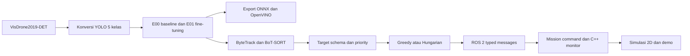

# Laporan End-to-End: Dataset VisDrone sampai ROS 2

Tanggal dokumen: 10 Agustus 2026 (Asia/Jakarta)  
Status scope: **selesai untuk prototipe perangkat lunak ROS 2 dan simulasi 2D**

## 1. Ringkasan

Proyek ini membangun alur terukur untuk persepsi objek aerial dan pengambilan keputusan misi multi-UAV: dataset VisDrone diunduh dan dikonversi ke lima kelas YOLO, model nano dievaluasi dan di-fine-tune, hasilnya diekspor serta divalidasi, video aerial diproses oleh tracker, target diberi prioritas dan ditugaskan ke UAV virtual, lalu keputusan dikirim melalui node ROS 2 Jazzy hingga divisualisasikan dalam simulasi 2D.



Alur tersebut adalah bukti integrasi perangkat lunak. Proyek ini **bukan** sistem UAV fisik, flight controller, bukti keselamatan penerbangan, maupun benchmark deployment produksi.

## 2. Lingkungan dan aturan reproduksibilitas

Pengembangan dan verifikasi dilakukan pada Windows 11 dengan WSL 2 Ubuntu 24.04, Python 3.12, ROS 2 Jazzy, PyTorch/Ultralytics, OpenCV, SciPy, dan OpenVINO. Setiap milestone menggunakan ID run, konfigurasi YAML, ringkasan JSON/CSV, dan artefak visual. Dataset mentah, checkpoint, serta MP4 besar disengaja tidak dimasukkan ke Git; manifest, hash, laporan, dan frame bukti tetap disimpan.

Dokumentasi instalasi ROS ada di [ROS_JAZZY_ENVIRONMENT.md](ROS_JAZZY_ENVIRONMENT.md), sedangkan perintah verifikasi bersih ada di [REPRODUCTION.md](REPRODUCTION.md).

## 3. Tahap 1 — Mengunduh dataset VisDrone2019-DET

Dataset yang dipakai adalah **VisDrone2019-DET**, task object detection pada gambar. Hanya split resmi train dan val yang digunakan. Sumber resmi, kebijakan akses, dan batas redistribusi dicatat di [VISDRONE_DATA.md](VISDRONE_DATA.md).

Perintah terdokumentasi untuk mengunduh dan memverifikasi sumber:

```bash
.venv/bin/python -m pip install -r requirements-day2.txt
.venv/bin/python scripts/download_visdrone.py --plan
.venv/bin/python scripts/download_visdrone.py --splits train val
```

Downloader mencatat SHA-256, ukuran ZIP, jumlah image/anotasi, serta waktu akses ke data/metadata/visdrone2019_det_download_manifest.json. Ekstraksi menolak path ZIP yang keluar dari direktori tujuan.

| Split | Image | Anotasi | Ukuran ZIP | SHA-256 |
| --- | ---: | ---: | ---: | --- |
| train | 6.471 | 6.471 | 1.549.875.511 byte | 86a77e...e256f84 |
| val | 548 | 548 | 81.638.851 byte | abeea0...2a35ef9 |

Unduhan awal dari Google Drive pernah terkena kuota publik. Data kemudian tersedia melalui mekanisme resmi/authorized yang sama dan diverifikasi pada manifest sebelum diproses. Dataset tidak didistribusikan ulang oleh repositori; ketentuan pemakaian harus diperiksa kembali untuk penggunaan publik atau komersial.

## 4. Tahap 2 — Konversi, sanitasi, dan audit data

VisDrone dikonversi menjadi format YOLO dengan lima kelas yang dikunci: pedestrian, car, van, truck, dan bus. Mapping lengkap dan aturan field anotasi terdapat di [VISDRONE_DATA.md](VISDRONE_DATA.md).

```bash
.venv/bin/python scripts/prepare_visdrone.py --check-config
.venv/bin/python -m pytest -q tests/test_visdrone_dataset.py tests/test_visdrone_audit.py tests/test_visdrone_distribution.py
.venv/bin/python scripts/prepare_visdrone.py
.venv/bin/python scripts/render_visdrone_audit.py --split val --samples 6
.venv/bin/python scripts/analyze_visdrone_distribution.py
```

Hasilnya berstatus passed_with_sanitization: 6.471 pasangan train dan 548 pasangan val tetap lengkap; konversi menghasilkan 267.960 objek train serta 25.884 objek val. Tiga bbox sumber dengan tinggi nol dikeluarkan dan dicatat, 34 trailing comma kosong dinormalisasi, dan validator output melaporkan nol bbox invalid serta nol overlap nama berkas antar-split. Enam overlay audit deterministik mencakup seluruh lima kelas dan telah diperiksa.

Bukti primer: [manifest lima kelas](../data/metadata/visdrone5_manifest.json), [ringkasan validasi](../experiments/D01_visdrone_validation/summary.json), dan [laporan Day 2](DAY_2_REPORT.md).

## 5. Tahap 3 — Baseline, smoke training, dan fine-tuning

### Baseline E00

Model COCO-pretrained yolo26n.pt dievaluasi pada subset validation terkunci berisi 128 image (6.090 objek) dengan CPU/FP32 dan ukuran 640. Hasil macro baseline E00 adalah precision 0,289228, recall 0,173370, mAP50 0,154190, dan mAP50-95 0,096881. Kelas van bernilai nol pada baseline karena label COCO tidak memiliki kelas van terpisah.

Dua percobaan baseline awal tidak menghasilkan metrik karena identitas nama file berubah menjadi nama sintetis. Keduanya tetap disimpan dengan metrics: null; run yang diterima adalah E00_20260807_003 setelah file-list .txt dipakai untuk mempertahankan nama sumber.

### Smoke dan E01

Smoke training tiga epoch membuktikan training GPU Tesla T4 dan resume dari checkpoint yang masih memuat state optimizer. Fine-tuning utama E01_20260807_001 menjalankan seluruh data train selama 30 epoch memakai AdamW, seed 42, batch 16, image size 640, dan AMP. Sesi terputus setelah epoch 11 lalu melanjutkan dari checkpoint epoch 10 dan tetap menyelesaikan 30 epoch.

Pada full validation, checkpoint akhir mencatat precision 0,53166, recall 0,38044, mAP50 0,38521, dan mAP50-95 0,23458. Perbandingan yang adil harus menggunakan subset terkunci E00 yang sama:

| Metrik macro | E00 pretrained | E01 fine-tuned | Delta absolut |
| --- | ---: | ---: | ---: |
| Precision | 0,289228 | 0,565079 | +0,275850 |
| Recall | 0,173370 | 0,388065 | +0,214695 |
| mAP50 | 0,154190 | 0,401769 | +0,247580 |
| mAP50-95 | 0,096881 | 0,253452 | +0,156572 |

Analisis E01 pada confidence 0,25 dan IoU 0,50 menemukan 2.975 TP, 3.115 FN, dan 1.243 FP dari 6.090 ground-truth. Kelemahan utama yang disimpan adalah small object, heavy occlusion, dan confusion van menjadi car (155 dari 237 confusion). Ini diagnosis pada satu operating point, bukan nilai AP atau benchmark deployment.

Dokumentasi dan bukti: [Day 2 report](DAY_2_REPORT.md), [E01 error analysis](E01_ERROR_ANALYSIS.md), [summary E00](../experiments/E00_20260807_003/summary.json), [summary E01](../experiments/E01_20260807_001/summary.json), dan [perbandingan terkunci](../results/day2/E00_vs_E01_20260807_001/summary.json).

## 6. Tahap 4 — Export dan agreement deployment

Checkpoint E01 diekspor ke ONNX Runtime FP32 dan OpenVINO FP16. Kedua backend divalidasi pada 16 image deterministik dengan input square 640, confidence 0,25, NMS IoU 0,7, dua warm-up, lalu satu pengukuran per image/backend.

| Backend | Agreement terhadap PyTorch | Mean latency CPU lokal | FPS dari mean |
| --- | --- | ---: | ---: |
| PyTorch FP32 | reference | 79,057 ms | 12,649 |
| ONNX Runtime FP32 | 498/498 match dua arah; IoU 0,999999 | 69,123 ms | 14,467 |
| OpenVINO FP16 | 99,598% reference; 100% candidate; IoU 0,999026 | 118,826 ms | 8,416 |

Gate deployment lulus pada B01_20260809_005. Riwayat kegagalan juga dipertahankan: pertama output tensor OpenVINO tanpa nama, kemudian perbedaan preprocessing rect=true; keduanya diperbaiki tanpa mengendurkan ambang agreement. Timing di atas adalah observasi satu run CPU WSL lokal, bukan benchmark produksi atau klaim real-time.

Rujukan: [Day 3 report](DAY_3_REPORT.md), [summary B01](../experiments/B01_20260809_005/summary.json), [agreement CSV](../results/day3/B01_20260809_005/agreement.csv), dan [benchmark CSV](../results/day3/B01_20260809_005/benchmark.csv).

## 7. Tahap 5 — Video aerial dan tracking

Untuk uji tracker dipakai stock video aerial Pexels asset 3978617: 1.920 x 1.080, 24 FPS, 270 frame, 11,25 detik. Ini POV drone/aerial, bukan POV manusia dan tidak mempunyai ground truth identitas.

ByteTrack dan BoT-SORT menggunakan checkpoint E01, video, threshold, frame range, serta batas timing yang sama. ByteTrack dipilih sebagai default karena lebih cepat dan memiliki total gap frame lebih kecil pada protokol tersebut.

| Tracker | Mean wall latency | FPS | Track unik | Total gap frame |
| --- | ---: | ---: | ---: | ---: |
| ByteTrack | 77,208 ms | 12,952 | 95 | 663 |
| BoT-SORT | 111,093 ms | 9,001 | 88 | 839 |

Preview beranotasi, key frame, trajectory CSV, dan timing per frame tersedia di results/day3/T01_20260809_002/. Metrik MOTA, IDF1, HOTA, serta jumlah ID-switch tidak diklaim karena video sumber tidak memiliki ground truth tracking yang sesuai.

Dokumentasi: [TRACKING_REPORT.md](TRACKING_REPORT.md) dan [summary tracking](../experiments/T01_20260809_002/summary.json).

## 8. Tahap 6 — Priority, assignment, dan state misi

Prioritas target merupakan kebijakan YAML dengan komponen kelas, zona, kecepatan, perubahan heading, reacquisition, dan confidence. Nilainya dibatasi pada rentang 0 sampai 1; ia bukan skor risiko universal.

Dua algoritma memakai input dan constraint yang sama: Greedy serta Hungarian (linear_sum_assignment). Keduanya menolak target lost, UAV unavailable, pasangan terlarang, serta target yang tidak mencapai confidence/priority minimum. Pada skenario overload yang diulang 100 kali, target kritis tetap teralokasi pada kedua metode.

| Algoritma | Total cost | Mean compute in-process |
| --- | ---: | ---: |
| Greedy | 0,704795 | 0,011142 ms |
| Hungarian | 0,511247 | 0,013507 ms |

Hungarian dipilih untuk konfigurasi ROS dan simulasi karena cost total lebih rendah pada skenario tersebut. Angka ini bukan latency jaringan/ROS atau performa flight control.

Rujukan: [ASSIGNMENT_REPORT.md](ASSIGNMENT_REPORT.md), [state machine](MISSION_STATE_MACHINE.md), dan [summary 100 repetisi](../results/day5/A01_20260809_002/summary.json).

## 9. Tahap 7 — Integrasi ROS 2 Jazzy

Graph ROS memakai message bertipe stabil dan transport lokal. Node sumber synthetic menerbitkan TargetArray; assignment_relay menjalankan priority + Hungarian; mission_relay menerbitkan MissionCommand dan MissionStatus; node C++ mission_monitor menerima status tersebut.

```text
/perception/targets (TargetArray)
  -> /assignment/decisions (Assignment)
  -> /mission/commands (MissionCommand)
  -> /mission/status (MissionStatus)
  -> C++ mission_monitor
```

Perintah build dan smoke yang terdokumentasi:

```bash
source /opt/ros/jazzy/setup.bash
cd ros2_ws
colcon build --merge-install --symlink-install
source install/setup.bash
cd ..
bash scripts/run_ros_gate7_smoke.sh G02_<new-id>
```

Run final G02_20260809_003 lulus dari source tree bersih. Ia membuktikan TargetArray bertipe, shared Hungarian assignment, MissionCommand, MissionStatus, dan penerimaan oleh C++ monitor. Input source sengaja synthetic dalam satuan synthetic_image_px, sehingga hasil ini membuktikan integrasi typed software, bukan transport radio, latency jaringan, atau kontrol fisik UAV.

Dokumentasi: [ROS_GRAPH.md](ROS_GRAPH.md), [Day 4 report](DAY_4_REPORT.md), dan [summary G02](../results/day4/G02_20260809_003/summary.json).

## 10. Tahap 8 — Simulasi 2D, replay ROS, dan demo

Simulator menjalankan tiga UAV virtual pada enam skenario deterministik, masing-masing 20 langkah dengan seed 17:

1. target lebih sedikit daripada UAV;
2. jumlah target sama dengan UAV;
3. overload (empat target, tiga UAV);
4. target kritis muncul pada langkah tertentu;
5. satu UAV menjadi unavailable;
6. target hilang lalu terdeteksi kembali.

Skenario overload, critical-arrival, dan UAV-unavailable dengan sengaja dapat berakhir dengan target yang tidak tertugaskan karena kapasitas/availability. Hal ini ditampilkan sebagai evidence, bukan disembunyikan. Semua posisi adalah abstract units atau synthetic image-space pixels, bukan koordinat fisik.

Final demo berdurasi 132 detik: enam skenario diikuti replay MissionCommand ROS yang ditangkap. File MP4 lokal berada pada results/day6/DEMO01_20260809_002/final_demo.mp4; bukti versioned yang lebih ringan adalah [summary demo](../results/day6/DEMO01_20260809_002/summary.json), [summary simulasi](../results/day6/SIM01_20260809_001/summary.json), dan [frame replay ROS](../results/day6/ROS01_20260809_005/mission_command_replay_final.png).

Dokumentasi lengkap: [SIMULATION_REPORT.md](SIMULATION_REPORT.md).

## 11. Cara memverifikasi ulang

Untuk verifikasi fungsional current workspace:

```bash
YOLO_CONFIG_DIR=/tmp .venv/bin/python -m pytest -q
source /opt/ros/jazzy/setup.bash
cd ros2_ws
colcon build --merge-install --symlink-install
source install/setup.bash
colcon test --merge-install --packages-select multi_uav_bringup
colcon test-result --verbose
```

Checkpoint tercatat: 82 test proyek lulus, satu test adapter ROS lulus, serta 12 test paket ROS tanpa error/failure (satu test skipped). Clean-checkout R01_20260809_005 juga lulus: source diekspor dengan git archive, workspace ROS dibangun ulang, dan command/status bertipe serta receipt C++ monitor tertangkap. Prosedur lengkap ada di [REPRODUCTION.md](REPRODUCTION.md).

## 12. Indeks dokumentasi dan artefak

| Kebutuhan pembaca | Dokumen / artefak utama |
| --- | --- |
| Sumber, unduh, kelas, dan lisensi VisDrone | [VISDRONE_DATA.md](VISDRONE_DATA.md), [LICENSES.md](LICENSES.md), manifest metadata |
| Konversi, baseline, training, dan error analysis | [DAY_2_REPORT.md](DAY_2_REPORT.md), [E01_ERROR_ANALYSIS.md](E01_ERROR_ANALYSIS.md) |
| Export model dan agreement | [DAY_3_REPORT.md](DAY_3_REPORT.md), results/day3/B01_20260809_005/ |
| Video aerial dan tracker | [TRACKING_REPORT.md](TRACKING_REPORT.md), results/day3/T01_20260809_002/ |
| Kebijakan assignment dan state | [ASSIGNMENT_REPORT.md](ASSIGNMENT_REPORT.md), [MISSION_STATE_MACHINE.md](MISSION_STATE_MACHINE.md) |
| Build, topic, message, dan C++ monitor ROS | [ROS_GRAPH.md](ROS_GRAPH.md), [ROS_JAZZY_ENVIRONMENT.md](ROS_JAZZY_ENVIRONMENT.md) |
| Simulasi, replay, dan demo | [SIMULATION_REPORT.md](SIMULATION_REPORT.md), results/day6/ |
| Verifikasi dan handoff | [REPRODUCTION.md](REPRODUCTION.md), [FINAL_REPORT.md](FINAL_REPORT.md), [DEFINITION_OF_DONE.md](DEFINITION_OF_DONE.md) |

## 13. Batasan akhir

- Evaluasi detector E00/E01 dan deployment terikat pada subset, protokol, dan hardware yang tercatat; angka tidak boleh dipindahkan menjadi klaim benchmark umum.
- Video tracking merupakan stock footage aerial tanpa ground truth identitas.
- ROS memakai target synthetic dan transport lokal; belum ada koneksi live dari detector ke pesawat, radio, atau UAV fisik.
- Simulasi tidak mencakup kalibrasi dunia nyata, perencanaan lintasan, collision avoidance, dinamika 3D, PX4, Gazebo/AirSim, atau kontrol kendaraan.

Status dan bukti final diringkas di [FINAL_REPORT.md](FINAL_REPORT.md).
